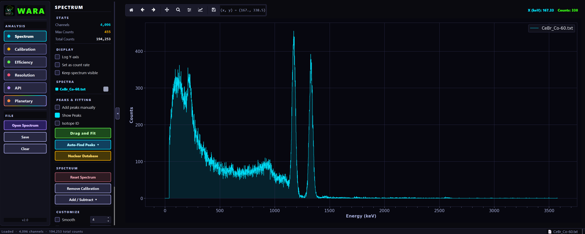
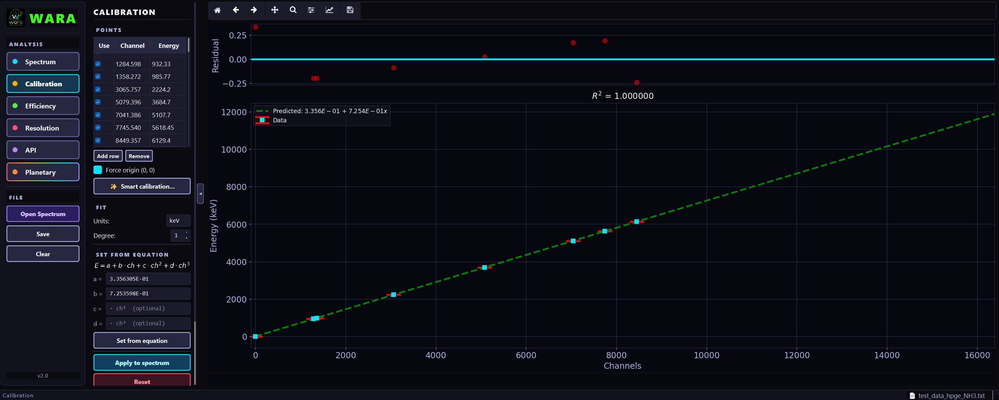
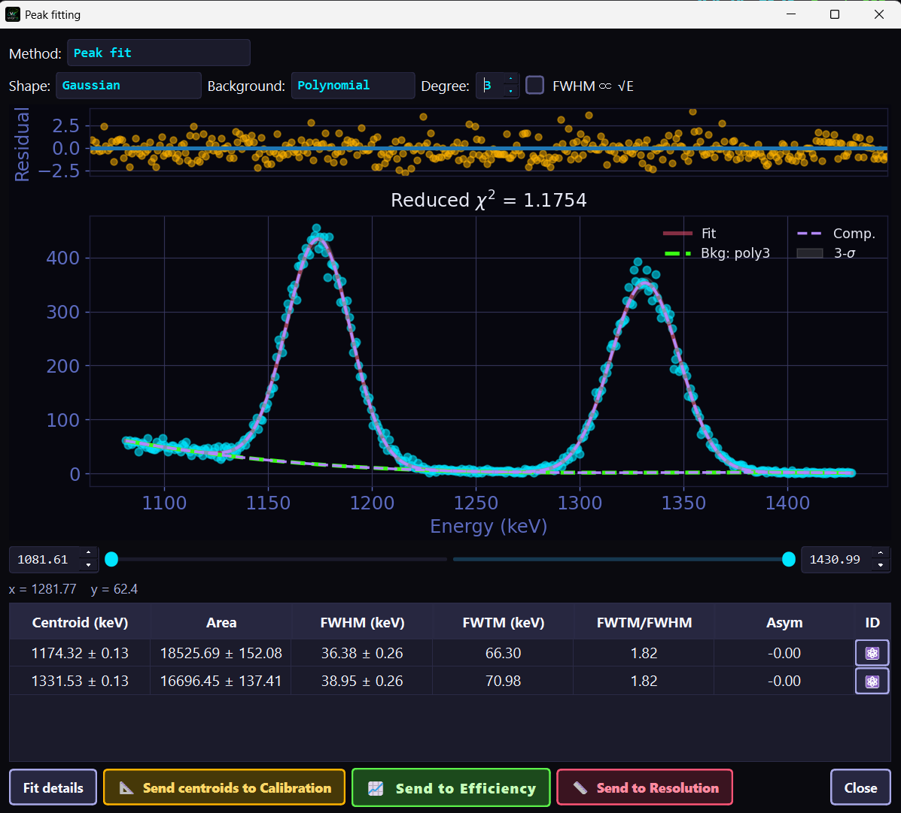
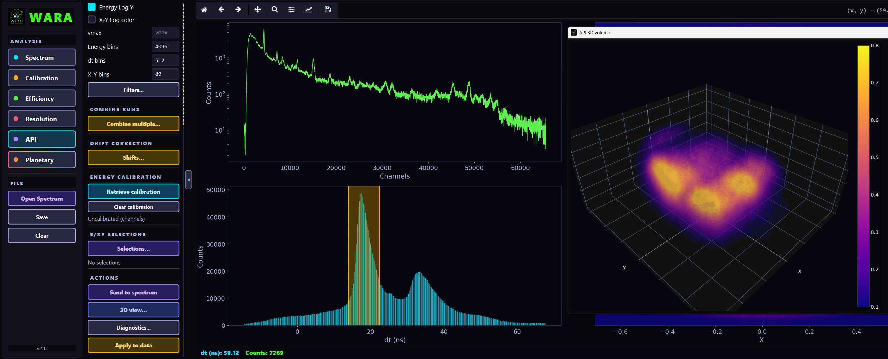

<p align="center">
  
</p>

<h1 align="center">Welcome to wara</h1>

<p align="center">
  <em>Gamma Ray &amp; Neutron Spectroscopy</em>
</p>

[](https://wara.readthedocs.io/en/latest/)

---

**wara** is a Python package for gamma-ray spectroscopy analysis and visualization. Some of its capabilities include:

1. Spectrum smoothing, rebinning, plotting
2. Peak searching given detector resolution and minimum SNR
3. Spectrum decomposition into signal, noise, and background
4. Peak fitting of multiple overlapping peaks with different background functions
5. Extraction of Gaussian components of peaks
6. Fully functional GUI
7. Energy calibration
8. Efficiency calibration
9. FWHM vs. energy plots
10. Time analysis from LYNX data
11. Data visualization for PIXIE data in the context of Associated Particle Imaging (API)
12. Gamma energy identification with built-in databases. Emphasis is placed on neutron induced gamma ray emission.

## Installation

wara runs on Python 3.10 or higher. You can install it by downloading the package directly:
```
git clone https://github.com/NASA-Planetary-Science/wara.git
```
then run
```
pip install -e .
```
from the directory where `pyproject.toml` is located.

## Using wara

Launch the GUI (if the path is set correctly, it can run from any directory;
otherwise, run from inside the `wara` folder):
```
wara
```
As of **v2.0**, `wara` opens the redesigned interface — a three-column layout
with a navigation rail (Spectrum, Calibration, Efficiency, Resolution, API,
Planetary), a contextual options panel, and the plot area. Run `wara --help`
for the full list of command-line options.

> The previous interface is still available during the transition period:
> ```
> wara --legacy
> ```

To take a quick tour: click **Open Spectrum** in the navigation rail and load
**examples → data → test_data_cebr.csv**. On the **Spectrum** tab, expand
**Auto-Find Peaks**, choose the **LaBr/CeBr** detector preset, and hit
**Find Peaks**. You should see several lines identified in the spectrum. Drag
the mouse over one or more lines to perform a Gaussian fit, and explore the
other tabs from there. Info buttons are placed strategically to guide the user.

The **Spectrum** tab — peak search, fitting, and isotope identification:



**Energy calibration** and Gaussian **peak fitting**:




The **API** tab — Associated Particle Imaging data exploration with linked
energy/time/X-Y panels and a 3D hit-cloud view:



## Data path configuration

If you use the API data loading features, create a file called `data-path.txt`
in the repo root directory with one data folder path per line:
```
C:/Users/yourname/Documents/my-data
D:/external-drive/more-data
```
wara will search each path in order and use the first one that contains the requested run.
This file is excluded from version control, so each user keeps their own local copy.

## Testing

After installation, run the test suite with:
```
pip install pytest
pytest tests/
```

To run a specific test file:
```
pytest tests/test_spectrum.py
```

## Documentation

Full documentation is available at **[wara.readthedocs.io](https://wara.readthedocs.io)**.

## Development

Code contributions are welcome!
