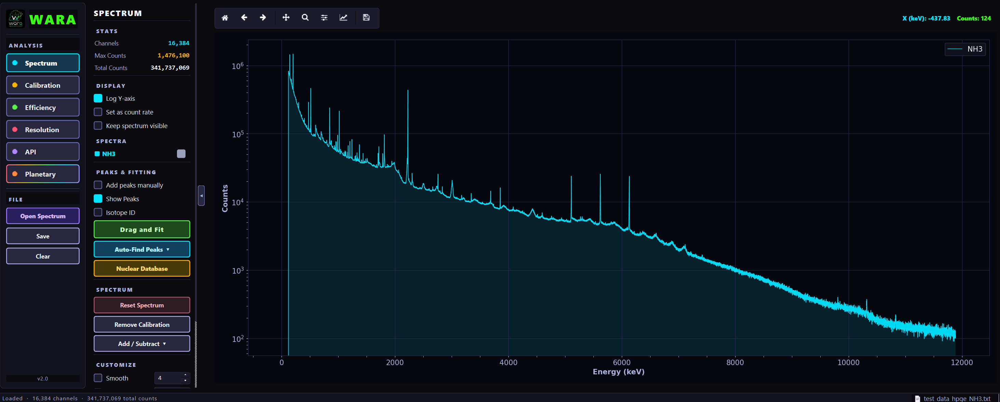
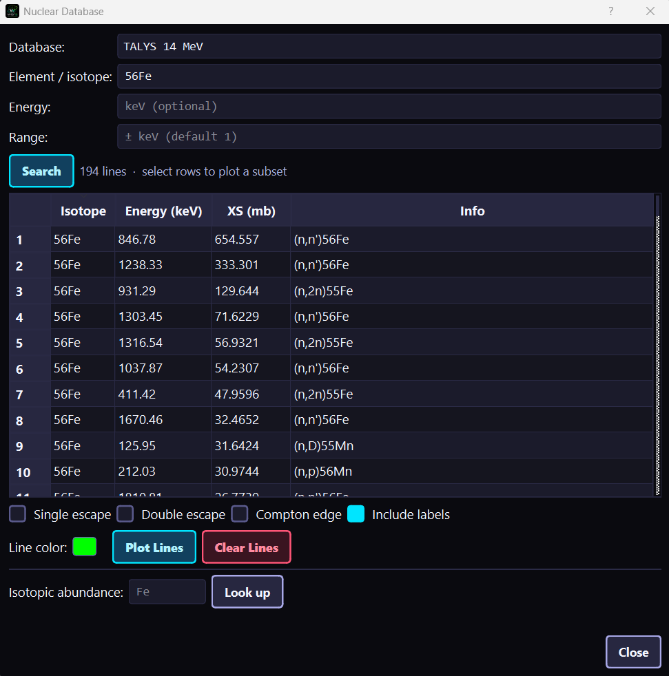

# The GUI

Everything in the User Guide is also available through wara's graphical
interface. As of **v2.0** the redesigned GUI is the default — a three-column
layout with a **navigation rail**, a contextual **options panel**, and the
**plot area**.

## Launching

```bash
wara              # the new GUI (default)
wara --legacy     # the previous interface, during the transition period
```

`wara --beta` is accepted as an explicit alias for the new GUI. You can also open
a file and preconfigure the peak search from the command line — see the
[Quickstart](quickstart.md#command-line-options).

## The Spectrum tab

The **Spectrum** tab is the hub: open a spectrum, find and fit peaks, and
identify isotopes. Click **Open Spectrum**, expand **Auto-Find Peaks** and pick a
detector preset, then use **Drag and fit** to fit lines by dragging across them.


The same workflow on an HPGe spectrum, where the high resolution and Hypermet
fitting matter:



Dragging across peaks opens the fit, with per-peak components, residuals, and the
chosen background model:


These map to [Peak Finding](peak_finding.md) and [Peak Fitting](peak_fitting.md).

## The Nuclear Database & isotope identification

A core feature of the Spectrum tab is identifying *which isotope* produced each
peak. wara ships several gamma-line **databases** and ranks the most likely
source isotope for every fitted energy.



The bundled databases (the same list the GUI shows) are:

| Database | Contents |
|----------|----------|
| **Common lab sources** | Calibration/check sources (e.g. ¹³⁷Cs, ⁶⁰Co, ²²Na) |
| **Natural radiation** | Naturally occurring lines (⁴⁰K, U/Th series) |
| **Delayed activation (IAEA)** | Activation-product decay lines |
| **Neutron capture (CapGam)** | (n,γ) capture gamma lines |
| **Neutron capture (IAEA)** | (n,γ) capture gamma lines (IAEA compilation) |
| **Inelastic (Baghdad)** | (n,n′γ) inelastic-scattering lines |
| **TALYS 14 MeV** | Computed 14.1 MeV reaction lines |

### How identification works

For each peak energy, candidate isotopes are ranked using each library's own line
strengths (cross section or intensity), then refined with:

- **Natural isotopic abundance** — for reaction-on-natural-target libraries
  (capture, inelastic, TALYS), the line yield scales with the target isotope's
  abundance. This is why a 846.8 keV line in natural iron is identified as ⁵⁶Fe
  (≈92 % abundant), not ⁵⁷Fe, even though ⁵⁷Fe's bare cross section is larger.
- **A terrestrial element-naturalness prior** — common rock/air/biological
  elements (O, Si, Fe, H, C, N…) are favored over rare ones.
- **Corroborating lines and escape peaks** — other lines of the same isotope, and
  the single/double-escape peaks (E − 511, E − 1022 keV) of high-energy gammas,
  boost a candidate. For example ¹⁶O's 6129 keV line together with its escapes
  and its 6917 / 3685 keV lines pin the assignment.

Source/decay libraries (lab sources, natural radiation, delayed activation) carry
specific radionuclides rather than sample elements, so the abundance and element
priors are not applied to them.

### From Python

The same engine is available programmatically in
{py:mod}`wara.nuclide_identificator`:

```python
from wara.nuclide_identificator import identify_best, rank_candidates

energies = [511.0, 846.8, 1460.8]   # keV, e.g. fitted peak centroids

identify_best(energies)        # single most likely isotope per energy
rank_candidates(energies)      # ranked candidates across all databases
```

`rank_candidates` returns comparable probabilities *across* libraries;
`identify` (not shown) returns the top candidates *within* each library
separately. Restrict the search with `databases=[...]` and set the matching
window with `tol` (a constant in keV or a callable `tol(energy)`).

## Calibration, Efficiency, and Resolution tabs

The next three rail entries wrap the calibration workflows. Send fitted peaks
over from the Spectrum tab; for energy calibration you can look up reference
energies from the nuclear database described above.


See [Energy Calibration](calibration.md), [Efficiency
Calibration](efficiency.md), and [Resolution](resolution.md).

## The API tab

The **API** tab is the interactive front end for Associated Particle Imaging:
load a run's parquet data into linked energy/time/X–Y panels, apply live filters,
send a selected spectrum back to the Spectrum tab, and explore the reconstructed
3D hit cloud.


See [Associated Particle Imaging](api.md).

## Tips

- **Info buttons** are placed throughout the GUI and give contextual guidance for
  each control.
- Most tabs **hand data to one another** — fitted peaks flow from Spectrum to
  Calibration, Efficiency, and Resolution; spectra flow from the API tab back to
  Spectrum.
