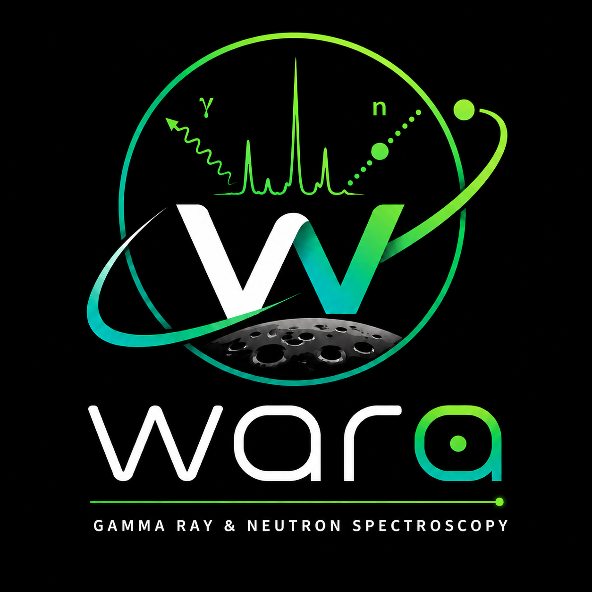

|

Welcome to wara
===============

**wara** is a Python package for gamma-ray and neutron spectroscopy analysis,
with an emphasis on neutron-induced gamma ray emission.

.. toctree::
   :maxdepth: 1
   :caption: Getting Started

   installation
   quickstart

.. toctree::
   :maxdepth: 1
   :caption: User Guide

   spectrum
   peaks
   calibration
   gui

.. toctree::
   :maxdepth: 1
   :caption: API Reference

   autoapi/index
