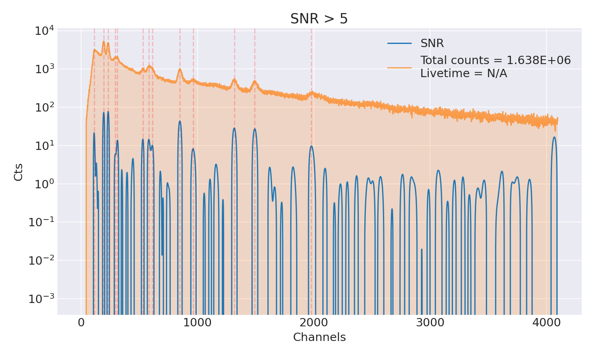
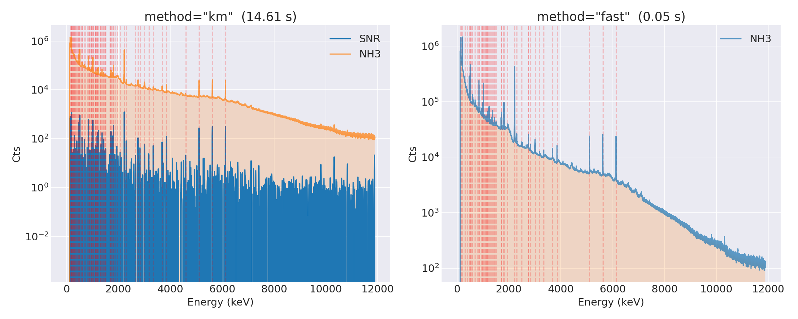
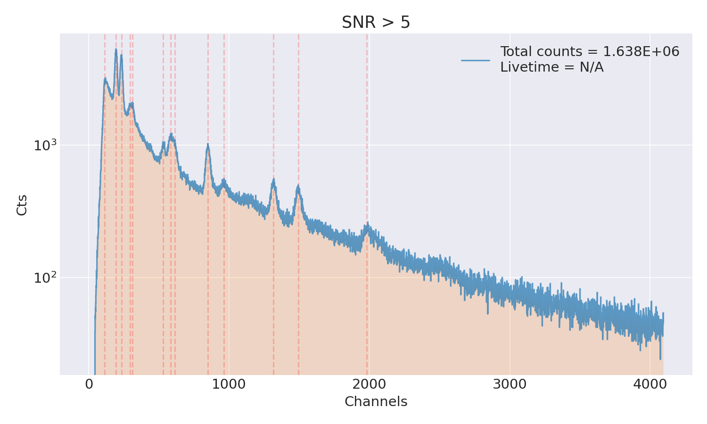
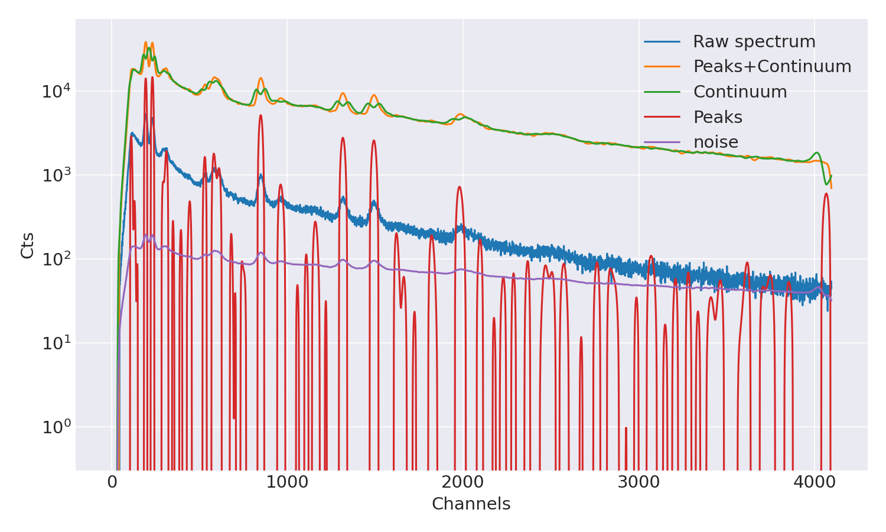
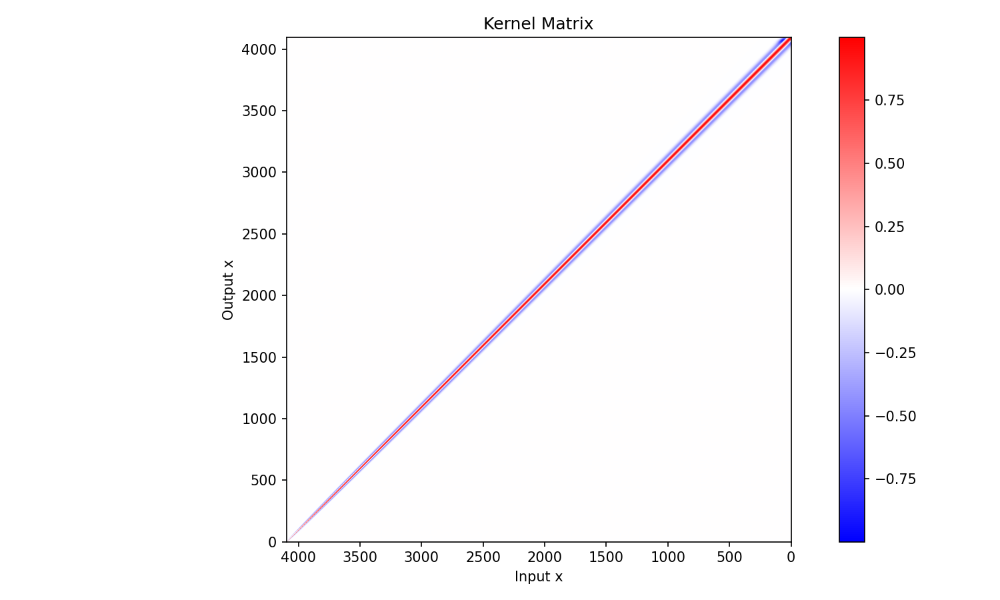

# Peak Finding

`PeakSearch` locates peaks in a {py:class}`~wara.spectrum.Spectrum` given the
detector's resolution (how FWHM grows with channel) and a minimum
signal-to-noise ratio. It is the usual first step before fitting.

```python
from wara import file_reader
from wara.peaksearch import PeakSearch

spect = file_reader.read_csv("examples/data/test_data_cebr.csv")
search = PeakSearch(spectrum=spect, ref_x=420, ref_fwhm=20, min_snr=5)
search.plot(yscale="log")
```



```{note}
The search runs automatically when the object is constructed — there is no
separate `find_peaks()` call. As soon as `PeakSearch(...)` returns, the results
(`peaks_idx`, `snr`, `fwhm_guess`, …) are populated.
```

## The resolution model

`PeakSearch` needs to know how wide a real peak should be at a given position so
it can tell peaks apart from noise. You describe this with a simple FWHM-vs-x
curve anchored by three numbers:

| Parameter | Meaning |
|-----------|---------|
| `ref_x` | A reference position where you know the peak width |
| `ref_fwhm` | The FWHM of the peak at `ref_x` |
| `fwhm_at_0` | The FWHM extrapolated to `x = 0` (default `1.0`) |
| `min_snr` | Minimum signal-to-noise ratio for a bump to count as a peak |

```{important}
`ref_x`, `ref_fwhm`, and `fwhm_at_0` are expressed in **channels**, not energy —
they describe the detector response on the raw channel axis. The `xrange`
argument (below), by contrast, follows the spectrum's current x-axis: channels
for an uncalibrated spectrum, energy for a calibrated one.
```

A higher `min_snr` is stricter and finds fewer, more confident peaks; lower it if
real lines are being missed. To search only part of the spectrum, pass an
`xrange`:

```python
# only look between x = 1200 and x = 1600 (channels or energy, per calibration)
search = PeakSearch(spect, ref_x=420, ref_fwhm=20, min_snr=5, xrange=[1200, 1600])
search.plot(yscale="log", snrs="off")
```

![Same spectrum, peaks searched only in [1200, 1600] — the two marked peaks both fall in that window even though the whole spectrum is still plotted (examples/peaksearch/example_peaksearch_cebr.py)](../figs/peakfind_xrange.png)

## Search methods

The `method` argument selects the algorithm:

| `method` | Description |
|----------|-------------|
| `"km"` *(default)* | Gaussian-kernel deconvolution. Also decomposes the spectrum into signal/continuum/noise (see {ref}`plot_components <peaksearch-components>`). Adapted from [becquerel](https://github.com/lbl-anp/becquerel). |
| `"fast"` | FFT-based; quicker on large spectra. |

The signal/continuum/noise decomposition is only produced by the `"km"` method.

```python
search_km = PeakSearch(spect, ref_x=420, ref_fwhm=5, min_snr=20, method="km")
search_km.plot(yscale="log")
search_fast = PeakSearch(spect, ref_x=420, ref_fwhm=5, min_snr=20, method="fast")
search_fast.plot(yscale="log")
```



On this ~16000-channel HPGe spectrum, `"km"` took **14.6 s** and found 69 peaks;
`"fast"` took **0.05 s** and found 52 — a real run, not a general guarantee, but
illustrates the trade-off: `"fast"` is dramatically quicker and finds most of
the same lines, `"km"` catches more (and is required for the component
decomposition below). Note `"fast"` has no SNR curve to overlay (`snrs="on"`
only draws it for `method="km"`), which is why the right panel shows just the
spectrum and its found peaks.

```{admonition} Credit
:class: seealso

The Gaussian-kernel deconvolution method (`method="km"`) is adapted from
**[becquerel](https://github.com/lbl-anp/becquerel)**, the open-source
nuclear-spectroscopy toolkit from the Applied Nuclear Physics program at
Lawrence Berkeley National Laboratory. We gratefully acknowledge their work.
```

## Reading the results

After construction, the key attributes are:

- `search.peaks_idx` — the found peak positions as **channel indices** (use
  `spect.energies[search.peaks_idx]` to get their energies on a calibrated
  spectrum).
- `search.snr` — the signal-to-noise curve.
- `search.fwhm_guess` — the estimated FWHM at each found peak (handy as starting
  widths for fitting).

Convenience helpers:

```python
search.metadata()                # dict: parameters + n_peaks + peak positions
search.peaks_in_range(0, 300)    # peak channels within a window -> [112 194 233 294]
search.to_csv("peaks.csv")       # channel, energy, fwhm_guess, snr per peak
```

## Plotting

```python
search.plot()                 # spectrum with found peaks marked + the SNR curve
search.plot(yscale="log", snrs="off")
```



(peaksearch-components)=
### Component decomposition (`km` only)

The kernel method separates the spectrum into peaks, continuum, and noise, which
is useful for judging whether a feature is real:

```python
search.plot_components()      # raw, peaks+continuum, continuum, peaks, noise
search.plot_kernel()          # visualize the kernel matrix itself
```





## In the GUI

This is the **Auto-Find Peaks** panel on the **Spectrum** tab: choosing a
detector preset (LaBr/CeBr, HPGe) fills in the resolution parameters for you,
and the **min SNR** field maps to `min_snr`. Once peaks are marked, drag across
them to fit — see [Peak Fitting](peak_fitting.md).

For the full list of parameters and methods, see
{py:class}`wara.peaksearch.PeakSearch` in the API reference.
