# Peak Fitting

Once peaks have been located with [Peak Finding](peak_finding.md), `PeakFit`
fits Gaussians on top of a background model over a chosen region and reports each
peak's position, net area, and FWHM with uncertainties. It is built from a
{py:class}`~wara.peaksearch.PeakSearch` object and uses
[lmfit](https://lmfit.github.io/lmfit-py/) under the hood.

```python
from wara import file_reader
from wara.peaksearch import PeakSearch
from wara.peakfit import PeakFit

spect = file_reader.read_csv("examples/data/test_data_cebr.csv")
search = PeakSearch(spectrum=spect, ref_x=1220, ref_fwhm=31, min_snr=5)

fit = PeakFit(search=search, xrange=[1250, 1600], bkg="poly1")
fit.plot()
print(fit.summary())
```

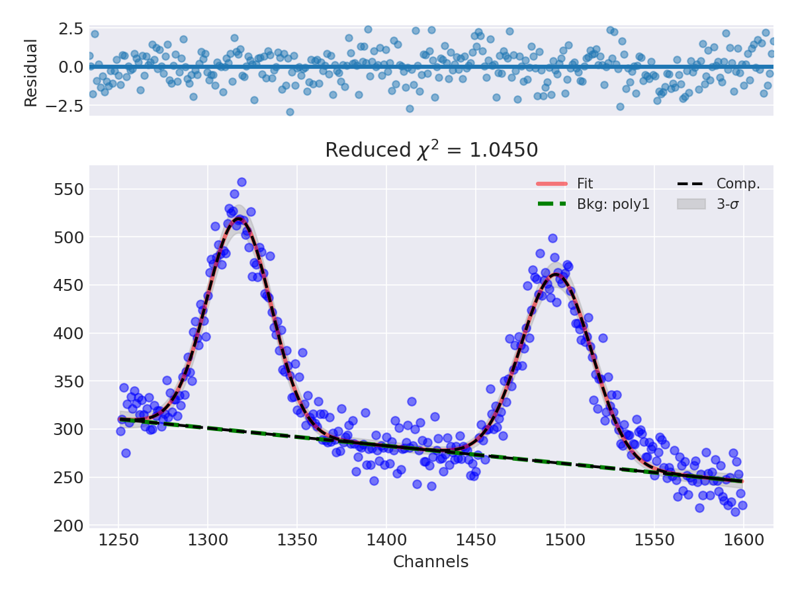

```{note}
Like `PeakSearch`, the fit runs automatically on construction — there is no
separate `fit()` call. Every peak the search found inside `xrange` is fitted
simultaneously, so overlapping peaks are handled in one go. If no peaks fall in
the range, a `ValueError` is raised (lower `min_snr` or widen `xrange`).
```

## Choosing the fit window and background

`xrange` is a `[x_min, x_max]` window in the spectrum's current x-units
(channels if uncalibrated, energy if calibrated). It should bracket the peak(s)
plus enough surrounding continuum to constrain the background.

The `bkg` argument selects the continuum model fitted beneath the peaks:

| `bkg` | Background model |
|-------|------------------|
| `"poly0"` … `"poly7"` | Polynomial of degree N (`"poly1"` is the default — a straight line) |
| `"linear"` | Straight line (same as `"poly1"`) |
| `"quadratic"` | Second-degree polynomial |
| `"exponential"` (or `"exp"`) | Exponential continuum |

## Reading the results

After construction, results live in a few parallel structures, one entry per
fitted peak (ordered by increasing position):

```python
fit.peak_info   # list of {"mean", "area", "fwhm"}
fit.peak_err    # list of {"mean_err", "area_err", "fwhm_err"}
fit.summary()   # all of the above as a pandas DataFrame
fit.fit_result  # the underlying lmfit ModelResult
```

```python
print(f"Peak 1 position: {fit.peak_info[0]['mean']:.2f} ({spect.x_units})")
print(f"Peak 1 area:     {fit.peak_info[0]['area']:.0f} counts")
print(f"Peak 1 FWHM:     {fit.peak_info[0]['fwhm']:.2f} ({spect.x_units})")
# Peak 1 position: 1317.52 (Channels)
# Peak 1 area:     9978 counts
# Peak 1 FWHM:     42.40 (Channels)
```

```{important}
`area` is the **net** counts under the peak (background already removed), not a
rate. For a spectrum stored as counts/s it is in counts/s; for raw counts it is
raw counts. Divide by `spectrum.livetime` yourself if you need a count rate.
```

### Goodness of fit

```python
fit.fit_quality()
# {'redchi': 1.045, 'aic': 23.26, 'bic': 54.10, 'nfev': 55,
#  'success': True, 'normaltest_pvalue': 0.904}
```

`redchi` (reduced chi-squared) near 1 indicates a well-scaled fit;
`normaltest_pvalue` tests whether the standardized residuals look like noise
(p ≳ 0.05 is good).

## Plotting

```python
fit.plot()   # data, best fit, per-peak components, residuals, and an n-sigma band
```

`plot` draws the fit and its residual panel together (see the figure at the top
of this page). Pass your own `fig`/`ax_fit`/`ax_res` to embed it in an existing
layout.

## Refining a fit

A few constructor options give you more control when the automatic fit needs
help:

- **`skew=True`** — fit skewed Gaussians instead of symmetric ones (useful for
  low-energy tailing).
- **`shared_sigma=True`** — tie every peak's width to a single detector
  resolution curve `fwhm(E) = |a + b·√E|`, instead of letting each peak's sigma
  float independently. Helpful for weak or heavily overlapping peaks:

  ```python
  spect = file_reader.read_csv("examples/data/test_data_cebr_cal.csv")
  search = PeakSearch(spect, ref_x=420, ref_fwhm=20, min_snr=3)

  fit_free = PeakFit(search, [280, 526], bkg="poly1")       # 3 peaks, free sigmas
  fit_shared = PeakFit(search, [280, 526], bkg="poly1", shared_sigma=True)
  ```

  

  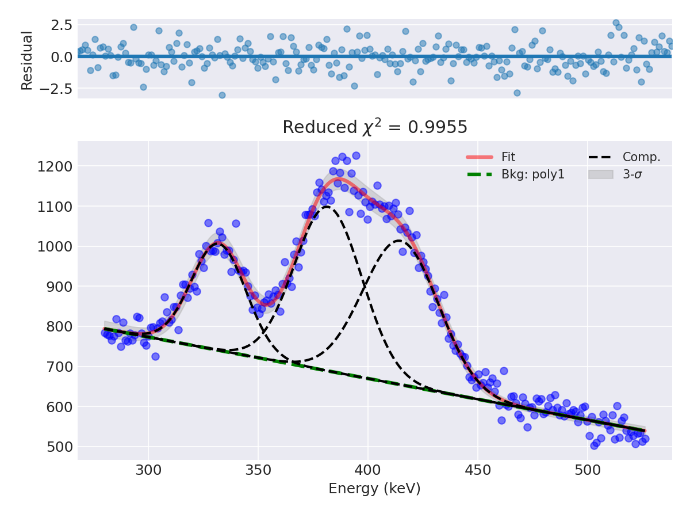
- **`hints={...}`** — override individual lmfit parameters before fitting, e.g.
  to fix a known line position:

  ```python
  spect = file_reader.read_cnf("examples/data/test_data_lab_sources.cnf")
  search = PeakSearch(spect, ref_x=420, ref_fwhm=20, min_snr=5)

  fit_free = PeakFit(search, [573, 666], bkg="poly1")
  known_center = fit_free.peak_info[0]["mean"]  # pretend this is a literature value

  fit_pinned = PeakFit(search, [573, 666], bkg="poly1",
                       hints={"g1_center": {"value": known_center, "vary": False}})
  ```

  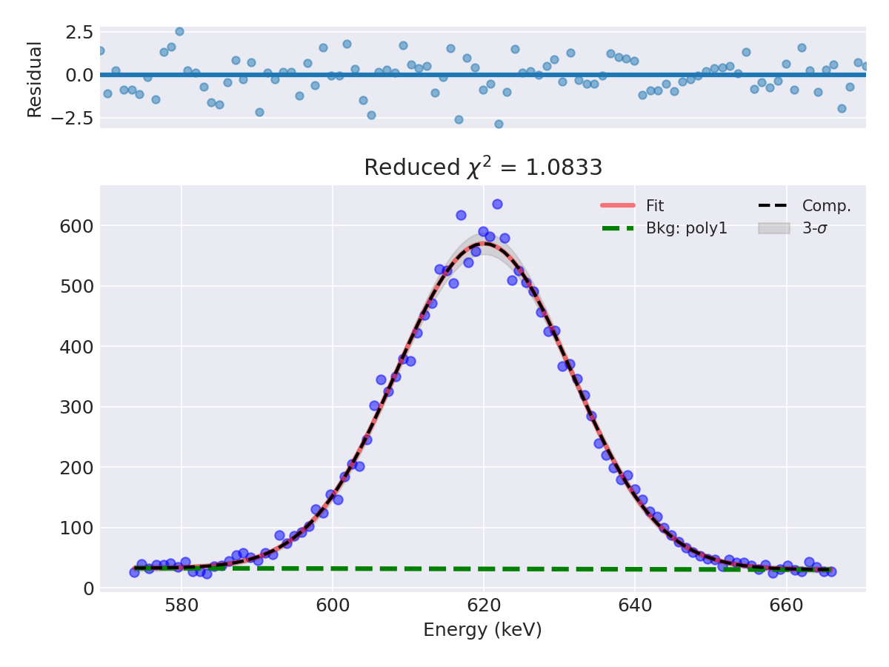

  Pinning a parameter removes it from the fit's degrees-of-freedom count, so
  even with an unchanged fit (same value) the reduced chi-squared shifts
  slightly: 1.095 free vs. 1.083 pinned here. `mean_err` is reported as 0 for
  the pinned center — lmfit gives no uncertainty for a non-varying parameter.

  Each hint maps a parameter name to attributes accepted by
  `lmfit.Parameter.set` (`value`, `min`, `max`, `vary`, `expr`). Peak components
  are named `g1_`, `g2_`, … in position order.

### Auto-tuning the fit range

`optimize_xrange` searches outward from your initial window and keeps the range
whose reduced chi-squared is closest to 1, updating the fit in place:

```python
fit = PeakFit(search, [573, 666], bkg="poly1")
best_range, best_redchi = fit.optimize_xrange(max_extend=5.0, n_steps=10)
```

![The initial [573, 666] window — a bit too tight, reduced chi-squared 1.095 (examples/peakfit/example_chi2_optimizer.py)](../figs/peakfit_optimize_before.png)

![After optimize_xrange widens the window to about [498, 681] — reduced chi-squared drops to 0.997](../figs/peakfit_optimize_after.png)

By default each edge of the window is searched independently (asymmetric);
pass `symmetric=True` to move both edges by the same offset instead — cheaper
(`n_steps` trials instead of `n_steps**2`) but less able to compensate when
only one side needs more continuum.

## Saving and reloading a fit

```python
fit.save_json("myfit.json")
fit = PeakFit.load_json("myfit.json", search)   # needs the same PeakSearch
```

## Extracting the Gaussian components

To pull the individual Gaussian shapes out of one or more fits (the package's
"Gaussian component extraction" feature), use `GaussianComponents`:

```python
from wara.peakfit import GaussianComponents

gc = GaussianComponents(fit_obj_lst=[fit])
gc.plot_gauss()          # draw the extracted Gaussians
gc.mean, gc.area, gc.fwhm  # per-component values
```

## Advanced profiles and backgrounds

For peaks that aren't well described by a Gaussian-on-polynomial, the
{py:mod}`wara.advanced_fit` module provides `PeakFit` subclasses with the same
interface:

| Class | Use |
|-------|-----|
| `MultiProfilePeakFit` | Voigt / pseudo-Voigt / EMG profiles and Doppler-broadened companions |
| `GaussStepFit` | Gaussian with a smeared **step** background (Compton edges) |
| `HypermetFit`, `FullHPGePeakFit` | Hypermet peaks with low-energy tails for HPGe |
| `ContinuumFit` | Fit the continuum alone, masking the peaks |

### Choosing a line shape with MultiProfilePeakFit

```python
from wara.advanced_fit import MultiProfilePeakFit

search = PeakSearch(spect, ref_x=420, ref_fwhm=3, min_snr=15, method="fast")

for profile in ("gauss", "voigt", "pvoigt"):
    fit = MultiProfilePeakFit(search, [2820, 2845], bkg="poly1", profile=profile)
    print(profile, fit.fit_quality())
```

On an isolated HPGe peak: `gauss` redchi=1.86/aic=25.7, `voigt` redchi=1.60/aic=20.7,
`pvoigt` redchi=1.65/aic=22.3 — Voigt wins on AIC here, but the margin is small
enough that a plain Gaussian is a defensible choice for less careful work.

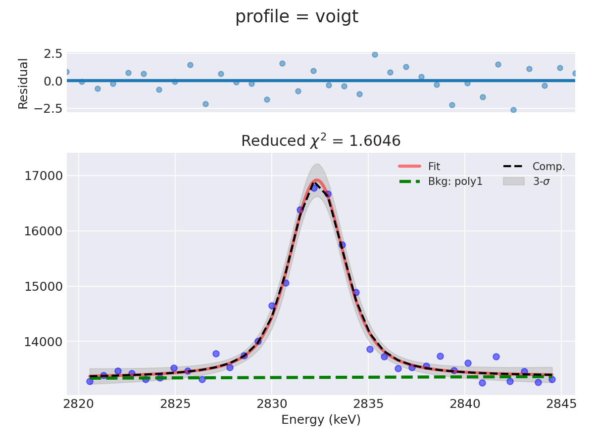

### GaussStepFit for a Compton-shelf peak

```python
from wara.advanced_fit import GaussStepFit

search = PeakSearch(spect, ref_x=1220, ref_fwhm=31, min_snr=5)
fit = GaussStepFit(search, [1070, 1260])   # step="sharp" by default
fit.plot()
```

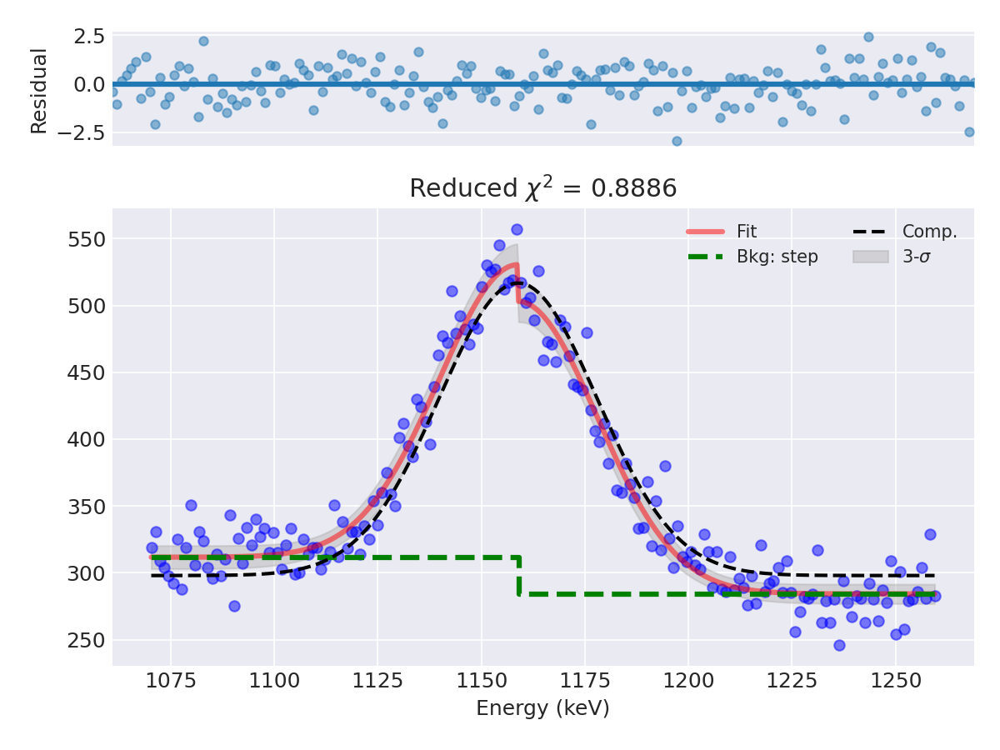

The same peak with a plain linear background has to compromise between the
higher continuum on the low-energy side and the lower one on the high side —
the step model tracks the data instead of averaging through it:

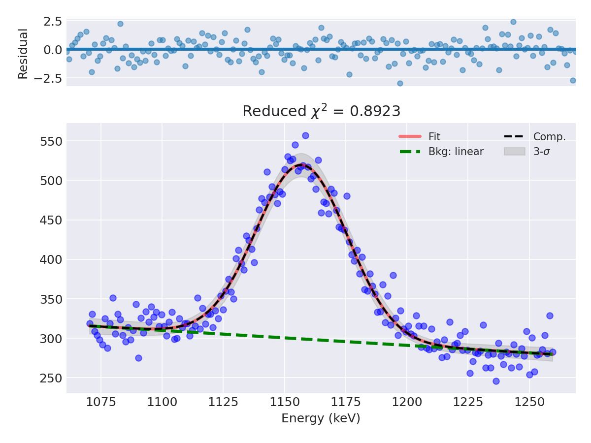

### ContinuumFit: the background alone

```python
from wara.advanced_fit import ContinuumFit

search = PeakSearch(spect, ref_x=420, ref_fwhm=3, min_snr=15, method="fast")
cont = ContinuumFit(search, xrange=[180, 540], degree=3, mask_fwhm=3.0)
cont.plot()
```

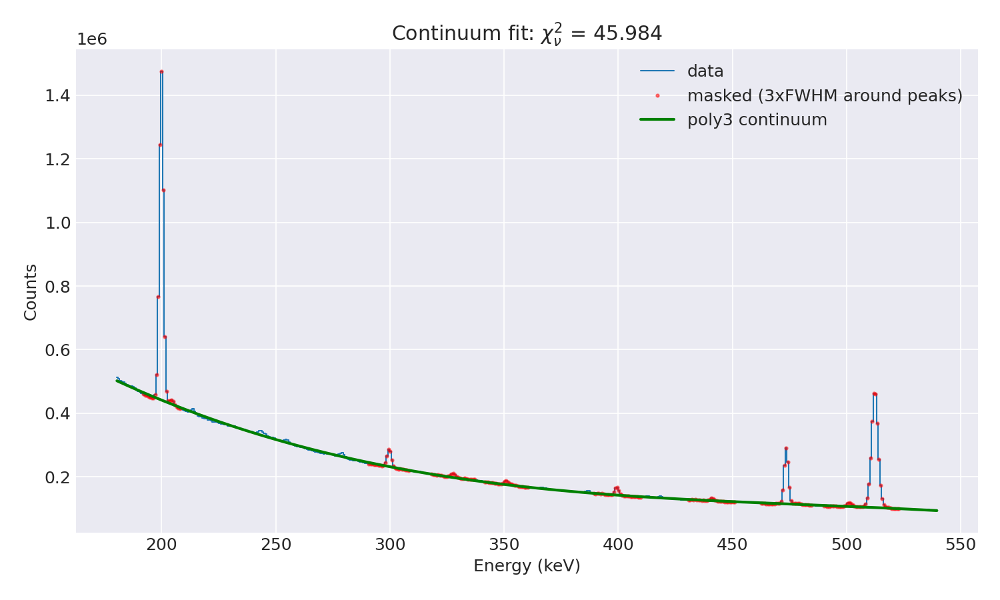

`ContinuumFit` masks every channel within `mask_fwhm` × FWHM of a detected peak
before fitting, so the polynomial only sees continuum. `cont.subtract()`
returns the peaks-only residual:

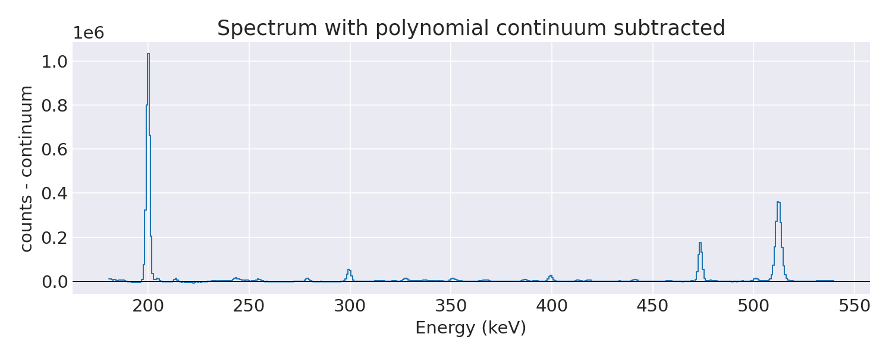

### Hypermet fitting for HPGe

High-resolution HPGe full-energy peaks are sometimes not symmetric: incomplete charge
collection drags a **low-energy tail** onto every peak. A plain Gaussian cannot
reproduce it — it leaves structured residuals on the low side and biases the
fitted area. The **Hypermet** shape (a Gaussian core plus an exponential
low-energy tail) is the canonical model used by dedicated gamma codes (GF3,
FitzPeaks, GammaVision) and is the recommended choice for careful HPGe peak-area
work.

`HypermetFit` is a drop-in `PeakFit` — same constructor, same `summary()`,
`fit_quality()`, `plot()`, and JSON round-trip. The 6129 keV line below is a
strong, visibly-tailed HPGe peak — a plain Gaussian gives reduced chi-squared
≈ 50:

```python
from wara.advanced_fit import MultiProfilePeakFit

search = PeakSearch(spect, ref_x=420, ref_fwhm=3, min_snr=15, method="fast")
gauss = MultiProfilePeakFit(search, [6100, 6150], bkg="linear", profile="gauss")
gauss.plot()
```

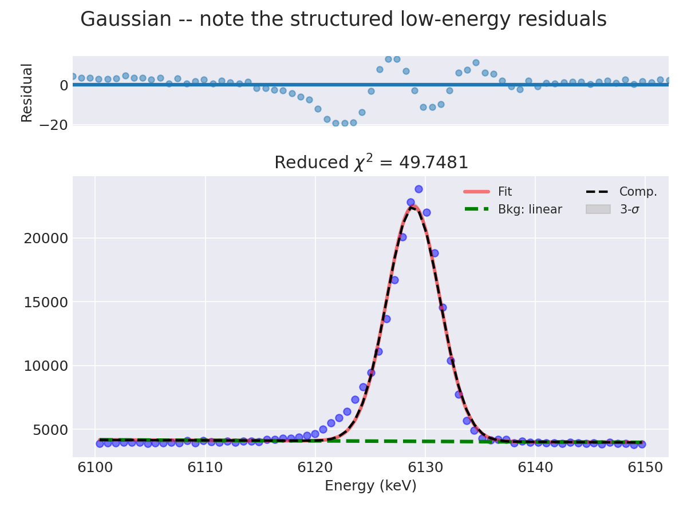

`HypermetFit` brings the same fit down to reduced chi-squared ≈ 2.4:

```python
from wara.advanced_fit import HypermetFit, shape_summary

fit = HypermetFit(search, xrange=[6100, 6150], bkg="linear")
fit.plot()              # the per-peak panel splits into "Core" and "Tail"
print(fit.summary())
```

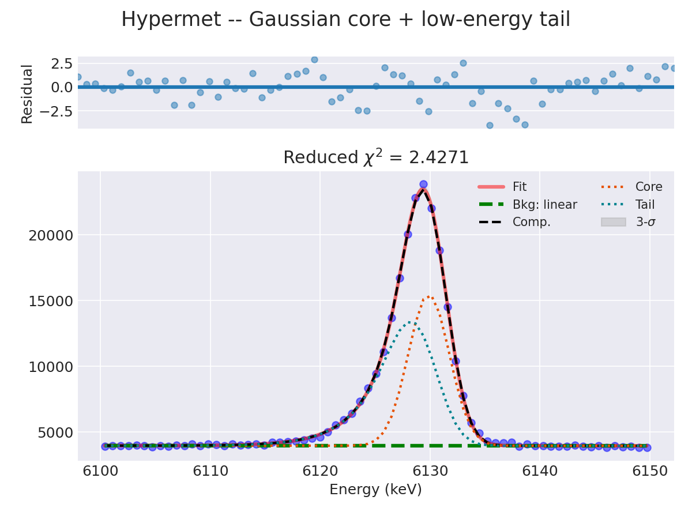

Each peak gains two parameters over a Gaussian:

| Parameter | Meaning |
|-----------|---------|
| `g{i}_tail_fraction` | Fraction of the peak area in the tail (0–0.95, initial `tail_fraction=0.1`) |
| `g{i}_tail_tau` | Tail length / decay constant (initial `tail_tau`, defaults to the peak's sigma) |

Because the Hypermet is built from unit-area components, `peak_info["area"]` is
already the **correct total area** (core + tail) — no extra bookkeeping needed.

```{important}
For asymmetric profiles the `fwhm` column in `summary()` is the **Gaussian-core**
value derived from sigma, not the true width of the tailed peak. Use
`shape_summary(fit)` to get the numerically measured FWHM, FWTM, the
`fwtm_fwhm` ratio, and an asymmetry metric — the proper way to quantify tailing:

    from wara.advanced_fit import shape_summary
    print(shape_summary(fit))
    #         mean  mean_err          area   area_err  fwhm  fwhm_err  fwhm_meas   fwtm  fwtm_fwhm  asymmetry
    #  6129.881436  0.046505 164826.262332 622.109071  4.40  0.046483   5.270595  11.38    2.158      0.244
```

The Gaussian-core `fwhm` (4.40 keV) understates the true, measured width
(`fwhm_meas`, 5.27 keV); `fwtm_fwhm` (2.158, vs. 1.823 for a pure Gaussian) and
the positive `asymmetry` both confirm the low-energy tail.

For a peak sitting on a Compton shelf, `FullHPGePeakFit` pairs the Hypermet tail
with a smoothed **step** continuum — the shape those dedicated codes fit to clean
HPGe singlets:

```python
from wara.advanced_fit import FullHPGePeakFit

fit = FullHPGePeakFit(search, xrange=[6100, 6150])   # step="sharp" by default
fit.plot()
```

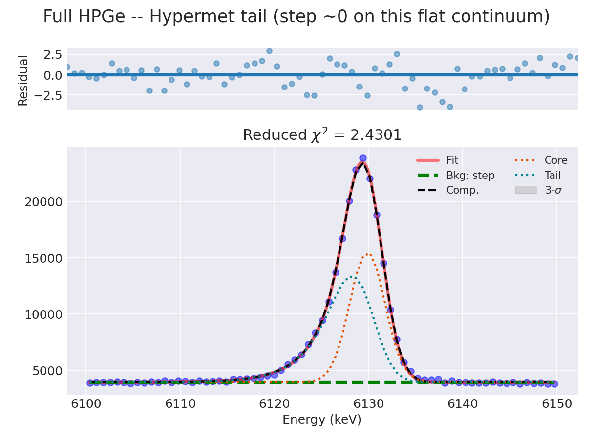

Here the *tail* models the smooth low-energy excess just below the peak while the
*step* captures the discrete Compton shelf. Keep the default `step="sharp"`
unless a strong real step is present; a `"smooth"` step shares the peak's centre
and width, overlapping the tail and risking a degenerate, non-converging fit.
Note `shared_sigma` is not supported with the step background.

## In the GUI

This is the **Drag and fit** action on the **Spectrum** tab: after finding
peaks, click **Drag and fit** and drag the mouse across one or more lines to set
the `xrange` and fit them. The background model and profile options are exposed
in the fit panel.

For the complete parameter list, see {py:class}`wara.peakfit.PeakFit` in the API
reference.
