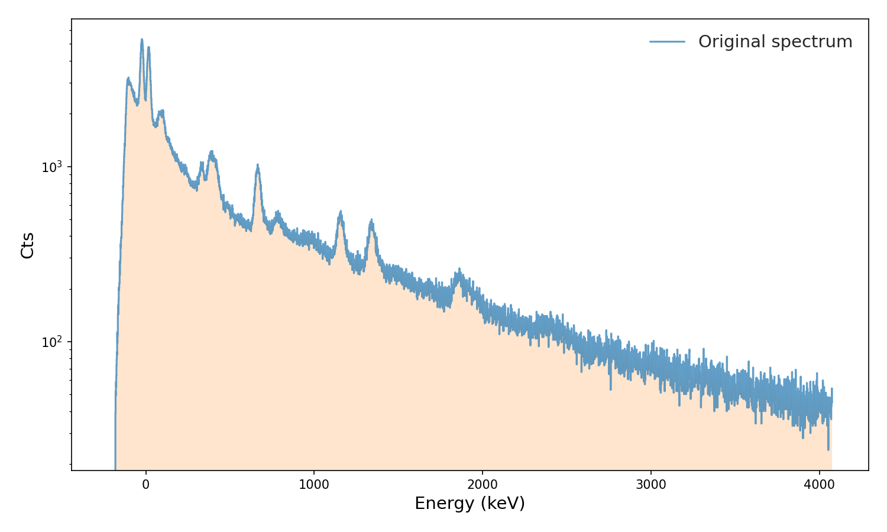
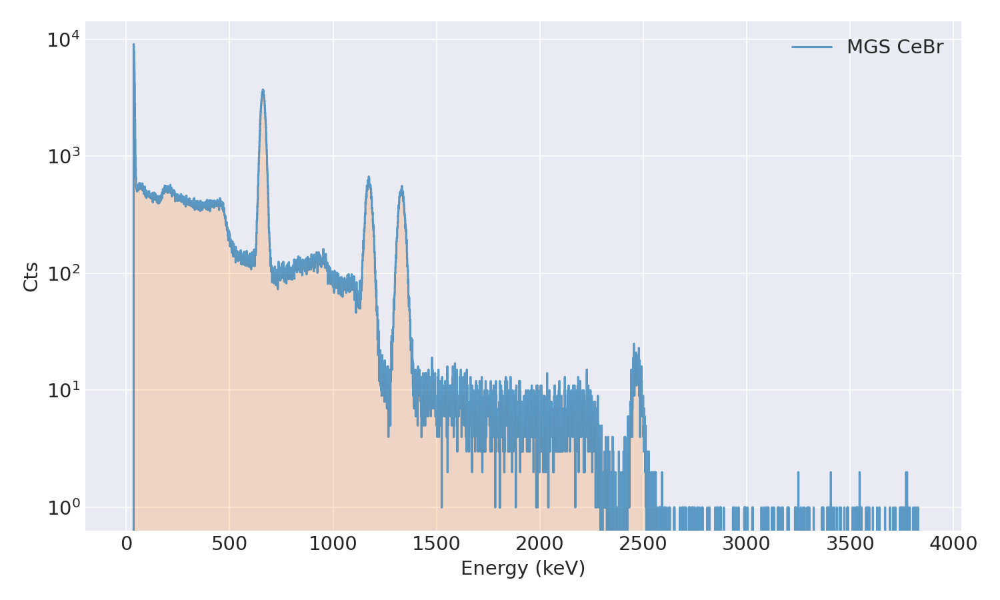
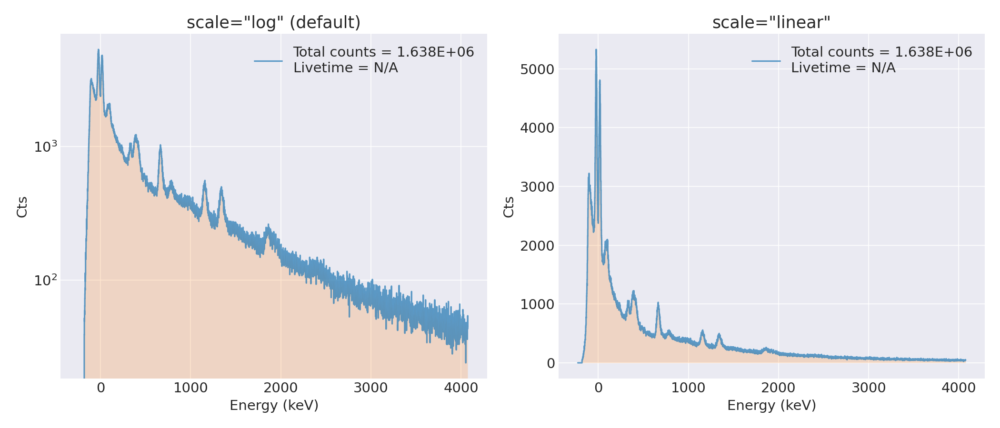
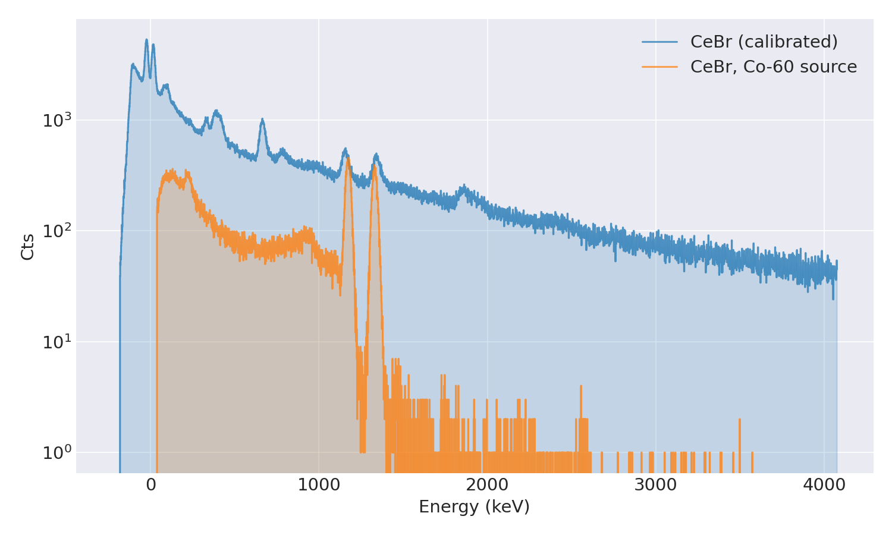
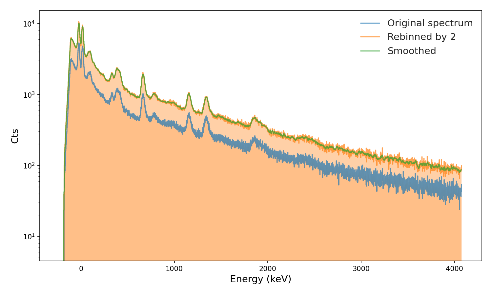
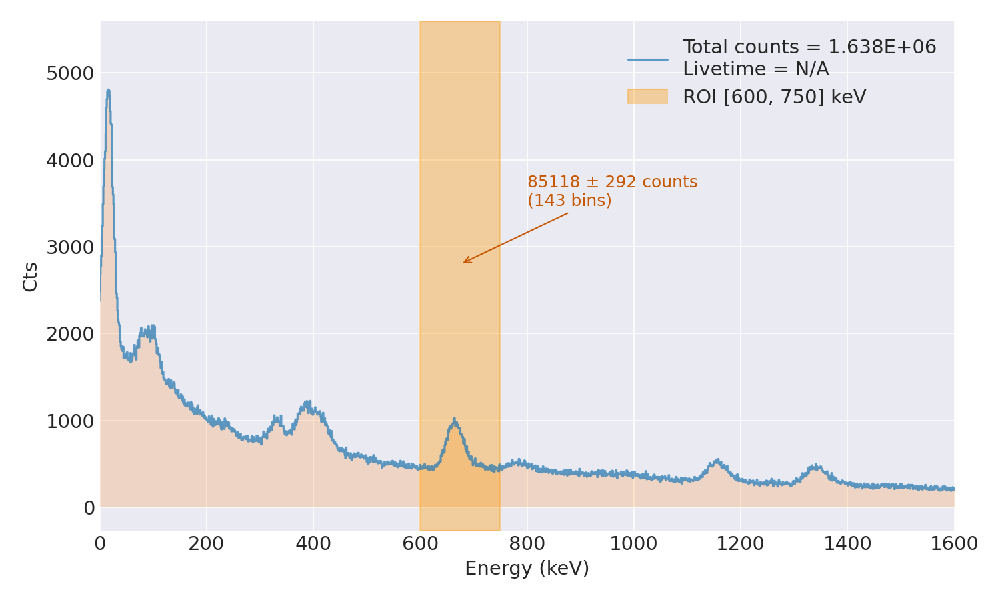
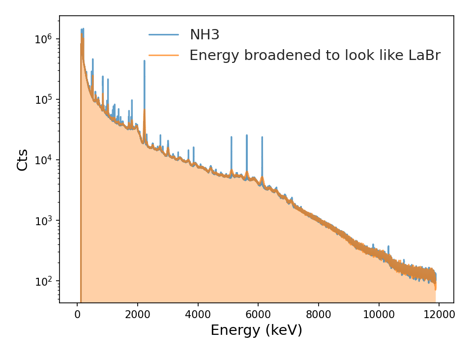
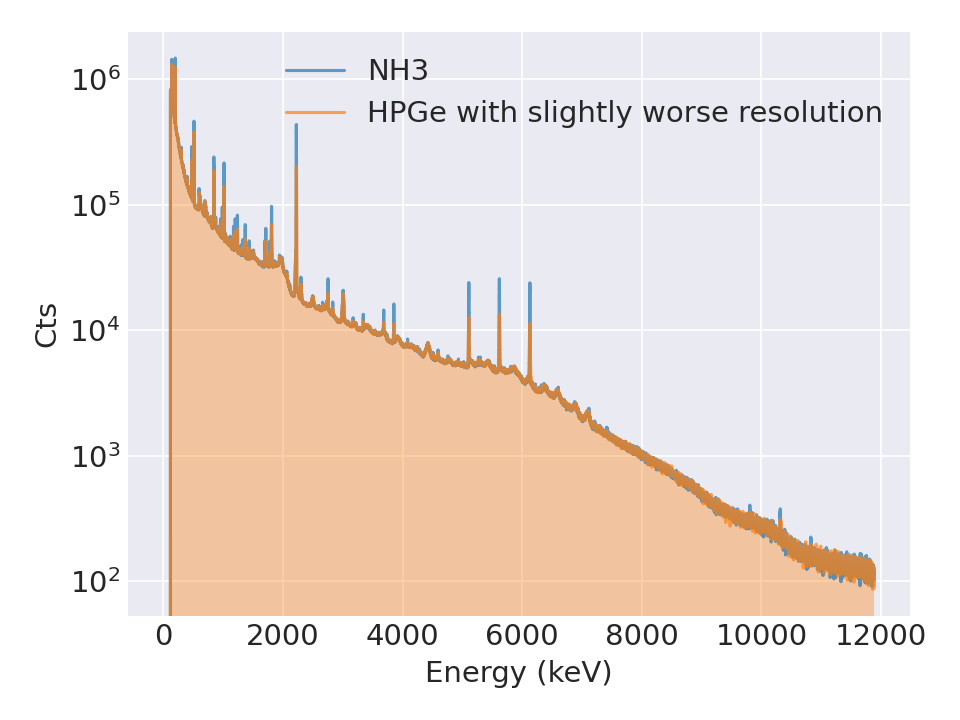
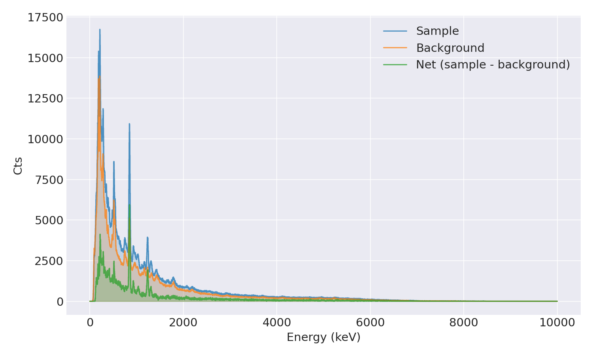

# Spectrum

The `Spectrum` class is the core data container in wara. It holds the per-bin
counts, their uncertainties, an optional energy axis, and measurement metadata
(live time, real time, acquisition date, …). Almost everything else in wara —
peak searching, fitting, calibration, efficiency — operates on a `Spectrum`
object.

## Loading a spectrum

The usual way to obtain a `Spectrum` is to read a file with the
{py:mod}`wara.file_reader` module. Each reader returns a ready-to-use
`Spectrum`:

```python
from wara import file_reader

spect = file_reader.read_csv("examples/data/test_data_cebr_cal.csv")
ax = spect.plot()
```



| Reader | File type |
|--------|-----------|
| `read_csv` | `.csv` with a counts column (and optional energy column) |
| `read_txt` | `.txt` (wara's own format, with metadata headers) |
| `read_spe` | `.spe` (ORTEC/Maestro) |
| `read_cnf` | `.cnf` (Canberra/Genie) |
| `read_mca` | `.mca` (Amptek) |
| `read_lynx_csv` | `.csv` exported from a Mirion/Canberra Lynx |

```{note}
For CSV files the counts column must be named one of `counts`, `cts`, `data`,
or `countrate(cps)`. An energy column (`energy`/`erg`, optionally with a unit
such as `energy_keV`) is detected automatically; if none is present, the
spectrum's x-axis falls back to channel numbers. The GUI's **Open Spectrum**
button dispatches to these same readers based on the file extension.
```

### Constructing one directly

You can also build a `Spectrum` from arrays you already have in memory. `counts`
is the only required argument. For example, reading a file yourself with
`pandas` instead of going through {py:mod}`wara.file_reader`:

```python
import pandas as pd
from wara.spectrum import Spectrum

df = pd.read_csv("examples/data/test_data_MGS_CeBr.csv")
spect = Spectrum(counts=df["counts"], energies=df["Energy [keV]"], e_units="keV",
                 label="MGS CeBr")
ax = spect.plot()
```



Provide `energies` (and `e_units`) if the spectrum is already calibrated;
otherwise the x-axis is a 0…N channel index. If you don't pass `counts_err`,
wara assumes Poisson errors `sqrt(max(counts, 1))` per bin.

## The x-axis: channels vs. energy

Every spectrum exposes a single working axis, `spect.x`:

- **Uncalibrated** — `spect.x` is the channel index (`spect.channels`) and
  `spect.x_units` is `"Channels"`.
- **Calibrated** — once energies are present, `spect.x` is the energy axis
  (`spect.energies`) and `spect.x_units` becomes e.g. `"Energy (keV)"`.

Functions that take an x-range (peak search, fitting, ROI counts) interpret
those values in whatever units `spect.x` currently carries. See
[Calibration](calibration.md) for `apply_calibration()` / `remove_calibration()`.

## Plotting

```python
ax = spect.plot()                 # log y-scale by default
ax = spect.plot(scale="linear")   # or pass your own Axes via ax=...
```



The log scale (the default) keeps small high-energy peaks visible; on a linear
scale they're flattened by the dominant low-energy peak.

`plot()` returns the matplotlib `Axes`, so you can keep customizing it or
overlay further data. To compare several spectra on one figure:

```python
from wara.spectrum import plot_overlay

plot_overlay([spect_a, spect_b], scale="log")
```



## Processing

These methods modify the spectrum **in place**. Call `spect.copy()` first if you
want to keep the original.

```python
spect.smooth(num=4)        # moving average over `num` bins (counts-preserving)
spect.rebin(by=2)          # combine every `by` adjacent bins; errors in quadrature
spect.gain_shift(by=3)     # slide the spectrum by 3 channels (or by=..., energy=True)
spect.normalize(by="counts")    # or by="livetime"
spect.replace_neg_vals()        # replace negatives (e.g. after a subtraction)
```



`rebin` **sums** adjacent bins rather than averaging them, so rebinning by 2
roughly doubles the counts per bin (the orange trace sitting above the
original blue one); `smooth` then reduces the bin-to-bin noise with little
change in overall level (green, nearly on top of the rebinned orange).

```{tip}
`gain_shift` is handy for aligning two spectra before subtracting. With
`energy=True` the shift is given in energy units and converted to channels
using the calibration's bin width.
```

### Region-of-interest counts

`roi_counts` sums the counts between two x-values and propagates the
uncertainty:

```python
roi = spect.roi_counts(600, 750)
print(roi["sum"], "±", roi["uncertainty"], "counts in", roi["n_bins"], "bins")
```



### Gaussian energy broadening

`gaussian_energy_broadening` convolves the spectrum with an
energy-dependent Gaussian whose FWHM you supply as a function of energy. It is
useful for matching one detector's resolution to another's (e.g. degrading a
high-resolution HPGe spectrum to a LaBr's resolution before comparing them), or
for turning an idealized line list into a realistic detector response. Poisson
statistics are preserved: counts are resampled per bin and redistributed across
the kernel, so the broadened spectrum keeps physically consistent noise.

```python
# A built-in curve ships with the class:
spect.gaussian_energy_broadening(Spectrum.fwhm_LaBr_example)
```



```python
# ...or define your own resolution curve:
def fwhm_hpge(E):
    return 0.1 * np.sqrt(E) + 0.001 * E

spect.gaussian_energy_broadening(fwhm_hpge)
```



Scintillator resolution is conventionally quoted as the percent FWHM at the
662 keV ¹³⁷Cs line (≈3% for LaBr₃, ≈7% for NaI). `fwhm_pct_at_662` turns that
single number into a resolution curve — assuming the usual `FWHM(E) ∝ √E`
scaling — so you don't have to hand-fit one:

```python
# Degrade to a LaBr-like 3% at 662 keV (keV-calibrated spectrum):
spect.gaussian_energy_broadening(Spectrum.fwhm_pct_at_662(3.0))

# For a MeV axis, express the 662 keV reference in MeV:
spect.gaussian_energy_broadening(Spectrum.fwhm_pct_at_662(3.0, e_ref=0.662))
```

This is what the Spectrum GUI's **Customize → Broaden res.** option uses.

```{important}
The FWHM function is evaluated at the spectrum's x-values, so its units should
match `spect.x` — apply broadening **after** the spectrum is energy-calibrated,
and make sure your curve returns FWHM in the same energy units. `fwhm_LaBr_example`
is calibrated for energy in MeV; a keV-calibrated spectrum (as above) needs a
custom function like `fwhm_hpge`, or a wrapper that converts units. A FWHM that
comes out ≤ 0 (as `fwhm_LaBr_example` can at low energy) leaves that bin
unbroadened rather than raising an error. Pass `random_seed=...` for
reproducible output. The method modifies the spectrum in place.
```

## Combining spectra

`Spectrum` supports arithmetic, with errors propagated in quadrature throughout.
This is the natural way to do background subtraction:

```python
total = sample + background        # add (e.g. summing repeated runs)
net   = sample - background        # subtract
sum(list_of_spectra)               # sum() works too

# Background with a different live time — scale before subtracting:
scale = sample.livetime / background.livetime
net   = sample - background * scale
```



```{note}
Spectra must be bin-compatible to combine (same number of bins and matching
x-axes), otherwise a `ValueError` is raised.
```

## Metadata and saving

```python
spect.metadata()      # dict of label, live/real time, units, total counts, …
spect.copy()          # deep copy

spect.to_csv("out.csv")   # counts + errors + x-axis (no metadata)
spect.to_txt("out.txt")   # includes metadata as a header block
```

For the complete list of attributes and methods, see
{py:class}`wara.spectrum.Spectrum` in the API reference.
